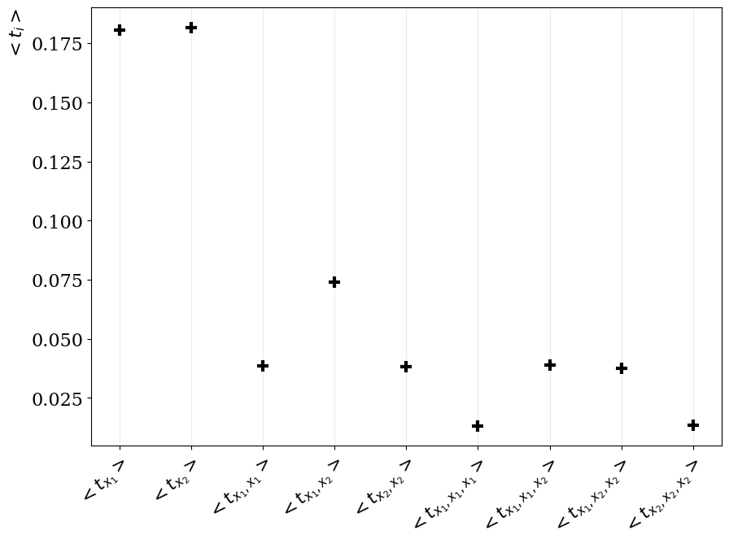

# Taylorcoefficient Analysis
this is a pytorch implementation of the Paper 
["Identifying the relevant dependencies of the neural network response on characteristics of the input space"](https://arxiv.org/abs/1803.08782) 
(S. Wunsch, R. Friese, R. Wolf, G. Quast)

As explained in the paper, the method computes the averaged taylorcoefficients of a taylored model function. These coefficients are noted as ">. 

This is the optimal method to identify not only first order feature importance, but also higher order importance (i.e. the importance of combined features).

This module can be applied to any differentiable pytorch model with a scalar output.

## Installation
```
pip install git+https://github.com/lsowa/tayloranalysis.git
```
or from ETP gitlab
```
pip install git+https://gitlab.etp.kit.edu/lsowa/tayloranalysis.git
```

## Usage

Setup your data and model, all you have to do is to wrap your model with the `TaylorAnalysis` class. A full example is shown [here](example/example.py). 
```
...
from tayloranalysis import TaylorAnalysis
...

model = Mlp()
model = TaylorAnalysis(model)

model.setup_tc_checkpoints(
    number_of_variables_in_data=2,    # dimension of your model input
    considered_variables_idx=[0, 1],  # variables to be tracked
    variable_names=["x_1", "x_2"],    # their representative name (plotting)
    derivation_order=3,               # calculates derivation up to 3, including 3
    eval_nodes='all',                 # compute TCs based on specified output node(s)
    eval_only_max_node=False          # compute TCs based on the output node with the highest value only?
)

...

for epoch in range(200):
    ...

    # save current taylorcoefficients
    model.tc_checkpoint(x_train, epoch=epoch) # x_train shape is as usual: (batch, features)

...

# plot saved checkpoints
model.plot_checkpoints(path="./tc_training.pdf")


# plot taylorcoefficients after training
# options similar to setup_tc_checkpoints
model.plot_taylor_coefficients(
    x_test,
    considered_variables_idx=[0, 1],  
    variable_names=["x_1", "x_2"],
    derivation_order=3,
    path="./coefficients.pdf",
)


```
Note that your data should be of shape (batch, features). `names` should be a list of all features in the same order as in the feature dimension of your data.

## Resluts




